# Sessions Marketplace — Architecture

This document captures the full system architecture for the Sessions Marketplace application. It covers the system context, application containers, frontend and backend structure, authentication and authorization flows, booking workflows, database design, deployment topology, and the core state transitions that define the application behavior.

---

## 1. Architectural Principles

- Modular monolith on the backend
- Client-side authentication via Supabase Auth
- Backend-owned authorization and business rules
- Frontend client-only React application with Tailwind CSS
- Containerized deployment using Docker Compose
- Clear ownership boundaries between User, Creator, and session resources
- Bonus-ready design for payments, object storage, and rate limiting

---

## 2. High-Level System Context

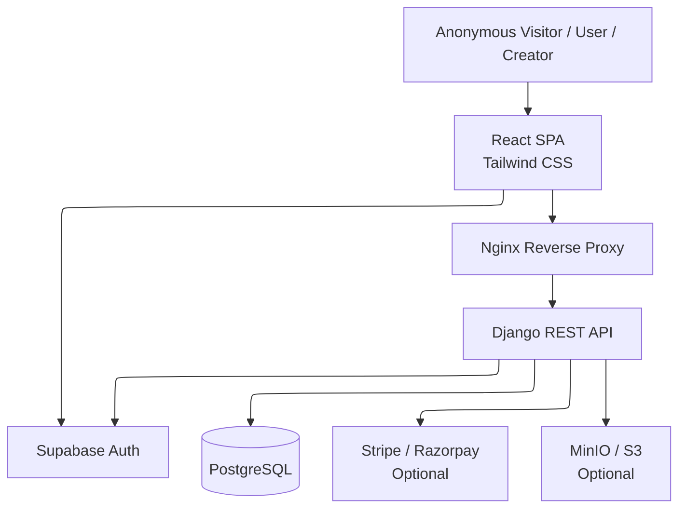

### Context Notes

- The browser interacts with the React frontend.
- Supabase Auth handles login, logout, and session issuance.
- The frontend sends Supabase access tokens to the backend in the `Authorization` header.
- The backend validates the token, authorizes the request, and executes business logic.
- PostgreSQL is the persistent source of truth for application data.

---

## 3. Container Architecture

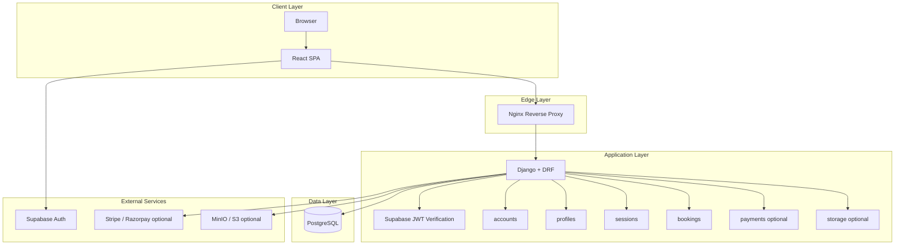

### Container Responsibilities

#### React SPA

- Renders the UI
- Manages Supabase session state
- Sends authenticated API requests
- Handles route-level protection in the UI
- Uses Tailwind CSS for styling

#### Nginx

- Serves as reverse proxy
- Routes frontend and backend traffic
- Can host static build output if desired
- Can later enforce rate limiting rules

#### Django + DRF

- Validates Supabase JWTs
- Enforces authorization and ownership rules
- Handles all business logic
- Persists data to PostgreSQL
- Exposes REST APIs

#### PostgreSQL

- Stores users, profiles, sessions, bookings, tags, images, and optional payment records

#### Supabase Auth

- Performs OAuth sign-in with Google or GitHub
- Issues session tokens for the frontend

---

## 4. Frontend Architecture

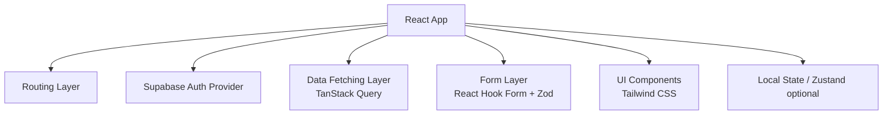

### Frontend Feature Structure

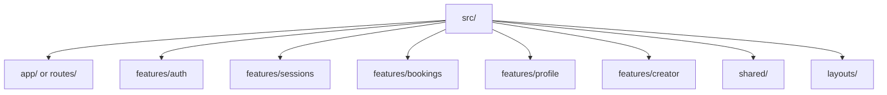

### Frontend Route Map

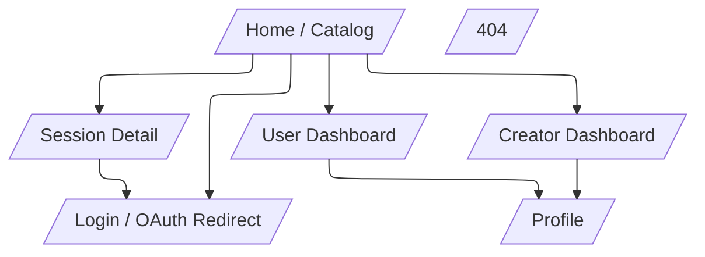

### Frontend Responsibilities by Page

#### Home / Catalog

- Lists published sessions
- Supports filtering, search, and pagination
- Displays login CTA

#### Session Detail

- Shows complete session information
- Presents booking action
- Displays creator details and availability

#### User Dashboard

- Shows active bookings
- Shows past bookings
- Shows profile summary

#### Creator Dashboard

- Lists owned sessions
- Shows booking overview
- Provides CRUD actions for sessions

#### Profile Page

- Shows name and avatar
- Allows profile updates

---

## 5. Authentication Architecture

### Auth Model

- Authentication is handled by Supabase Auth on the client side
- The backend does not perform OAuth login directly
- The backend validates the Supabase access token on every protected request
- Authorization and business logic remain fully backend-owned

### Auth Sequence

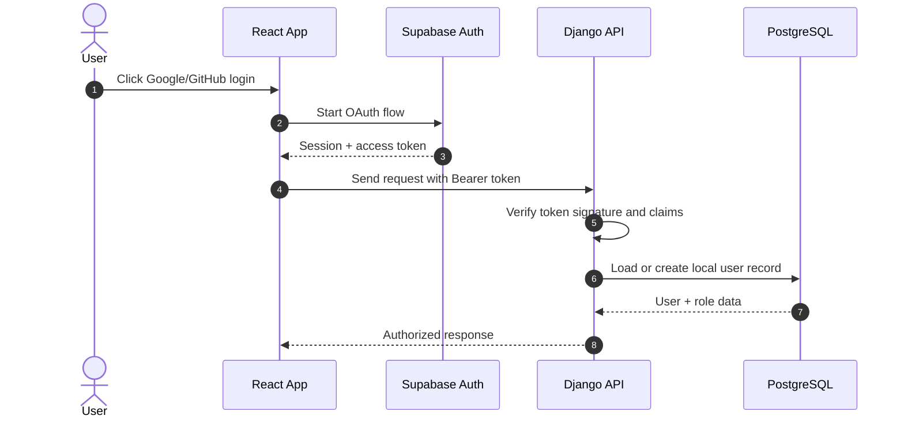

### Backend Authentication Rules

- Reject requests without a Bearer token
- Reject expired or invalid tokens
- Map the authenticated subject to a local user record
- Never trust frontend role claims alone
- Use backend-stored roles for authorization decisions

### Request Authorization Decision Tree

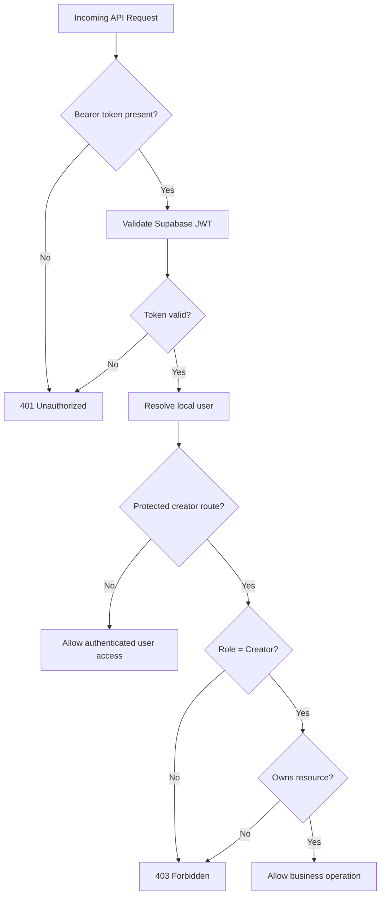

---

## 6. Backend Architecture

### Backend Layer Stack

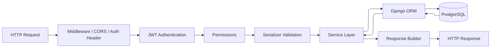

### Backend App Modules

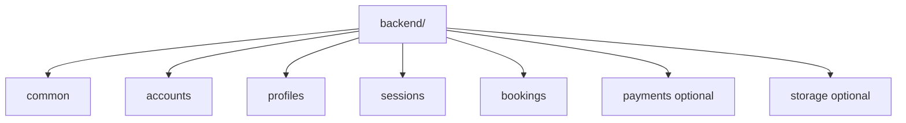

### Responsibilities of Each Backend App

#### common

- shared utilities
- base exceptions
- common response helpers
- base model mixins

#### accounts

- local user record handling
- Supabase identity mapping
- role resolution

#### profiles

- profile view/update
- avatar metadata management

#### sessions

- session CRUD
- publishing state
- search/filter logic
- creator ownership rules

#### bookings

- booking creation
- cancellation
- booking history
- capacity validation
- duplicate booking rules

#### payments optional

- payment intent lifecycle
- payment confirmation
- webhook processing

#### storage optional

- image upload abstraction
- storage provider integration

---

## 7. API Surface

### Public APIs

- `GET /api/sessions`
- `GET /api/sessions/:id`

### Authenticated User APIs

- `GET /api/me`
- `PATCH /api/me`
- `GET /api/bookings/me`
- `POST /api/bookings`

### Creator APIs

- `GET /api/creator/sessions`
- `POST /api/creator/sessions`
- `PATCH /api/creator/sessions/:id`
- `DELETE /api/creator/sessions/:id`
- `GET /api/creator/bookings`

### Optional Payments APIs

- `POST /api/payments/create-intent`
- `POST /api/payments/webhook`

### API Design Rules

- RESTful naming
- predictable response shapes
- pagination for list endpoints
- filtering for catalog endpoints
- ownership checks on creator endpoints
- authorization enforced server-side only

---

## 8. Booking Architecture

### Booking Flow

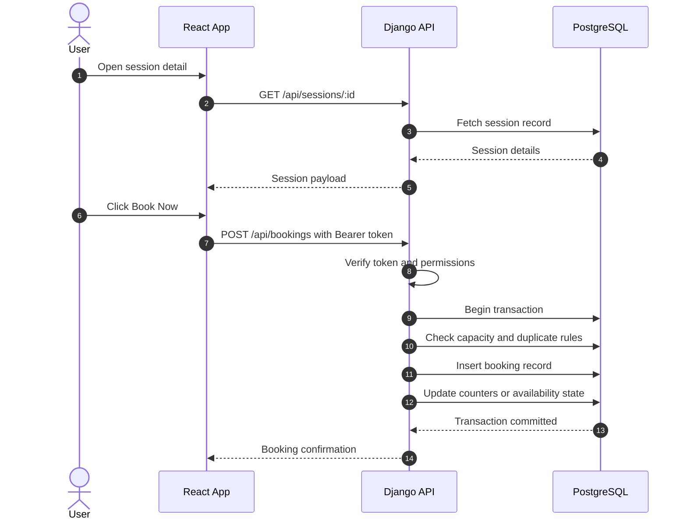

### Booking Rules

- Only authenticated users can book
- Session capacity must never be exceeded
- Duplicate booking rules must be enforced
- Booking creation must be transactional
- Users can view active and past bookings
- Creators can view bookings only for sessions they own

### Booking State Machine

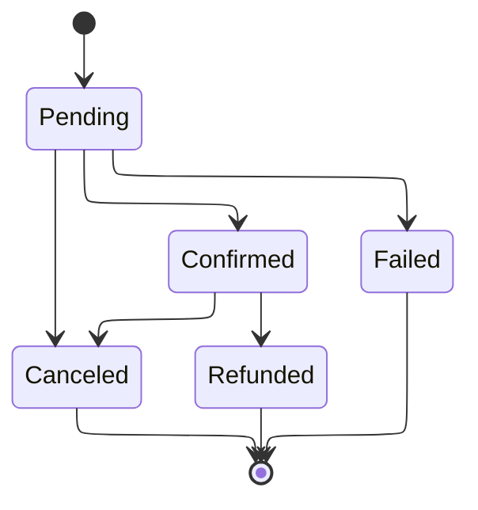

---

## 9. Session Architecture

### Session Lifecycle

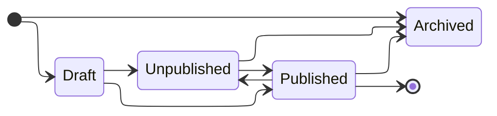

### Session Management Flow

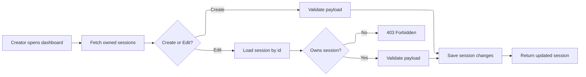

### Session Fields

- title
- description
- category
- difficulty
- duration
- price
- currency if needed
- capacity
- scheduled date/time
- location type
- status
- tags
- thumbnail
- gallery images optional
- creator reference

---

## 10. Database Architecture

### Database ER Diagram

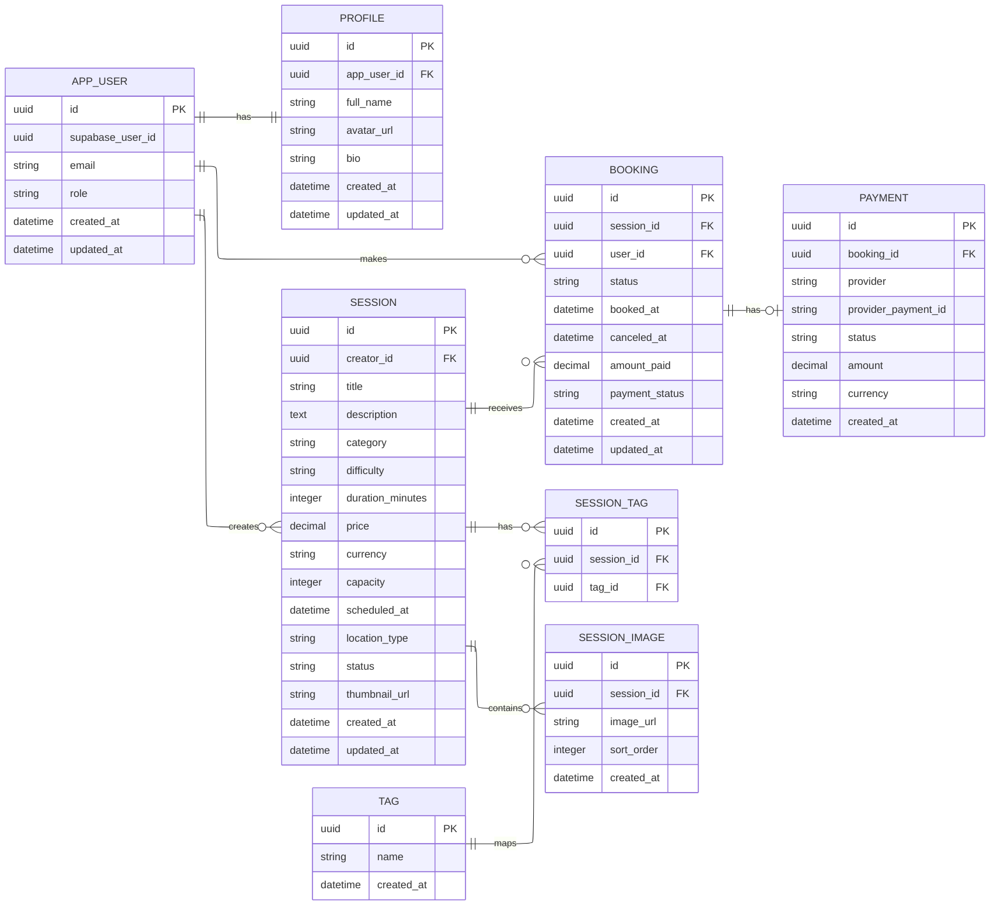

### Table Purpose Summary

#### USER

Stores the local application identity and role. The `supabase_user_id` links the local record to the Supabase Auth subject.

#### PROFILE

Stores display name, avatar, and optional bio.

#### OAUTH_ACCOUNT

Stores external identity-provider linkage if multiple providers are tracked explicitly.

#### SESSION

Stores marketplace session listings created by creators.

#### BOOKING

Stores user bookings for sessions.

#### TAG

Stores reusable labels for sessions.

#### SESSION_TAG

Maps many-to-many associations between sessions and tags.

#### SESSION_IMAGE

Stores session gallery images or media references.

#### PAYMENT

Stores payment lifecycle data when the bonus feature is enabled.

### Database Design Rules

- Use UUID primary keys
- Enforce foreign keys for relational integrity
- Enforce creator ownership through foreign key relations and backend checks
- Use unique constraints where appropriate, such as provider subject or session-user uniqueness
- Keep binary file data out of PostgreSQL; store only references

---

## 11. Authorization Architecture

### Authorization Layers

1. Token validation
2. Identity resolution
3. Role check
4. Ownership check
5. Business rule check

### Authorization Flow

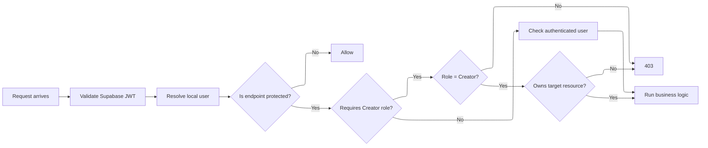

---

## 12. Deployment Architecture

### Deployment Diagram

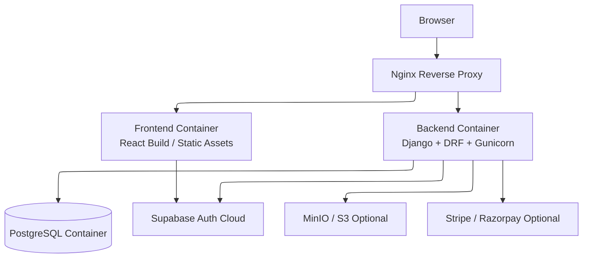

### Docker Compose Topology

- `frontend`
- `backend`
- `postgres`
- `nginx`

### Runtime Requirement

- One command must bring the system up:
  - `docker compose up --build`

### Deployment Rules

- Environment variables must be externalized
- Nginx should be the entry point
- Backend should not depend on manual local setup
- PostgreSQL data should persist across container restarts

---

## 13. Security Architecture

### Security Controls

- Validate JWTs on every protected backend request
- Do not trust client-side role flags
- Enforce creator ownership on update/delete operations
- Protect sensitive endpoints with rate limiting
- Verify webhook signatures for payment callbacks
- Keep secrets in environment variables only
- Configure CORS explicitly

### Request Security Pipeline

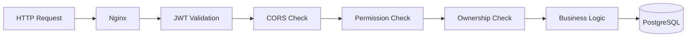

---

## 14. Optional Feature Architecture

### Payments

The booking workflow should support a later transition to paid bookings without redesigning the booking model.

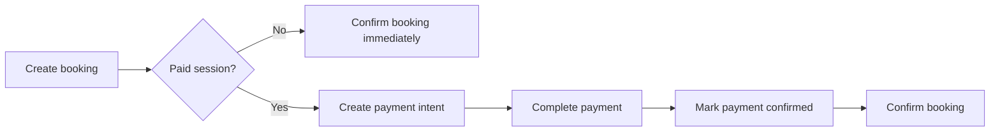

### MinIO / S3 Uploads

Use object storage for avatars and session images.

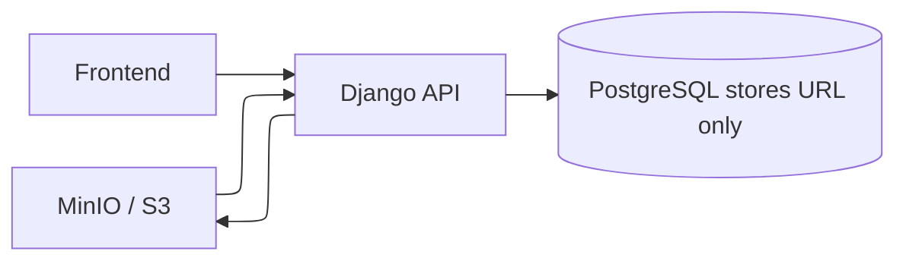

### Rate Limiting

Sensitive endpoints such as login-related or booking-related endpoints should be protected.

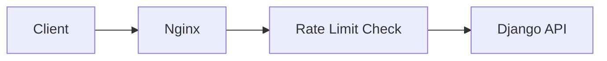

---

## 15. Observability and Quality Architecture

### Logging

- structured backend logs
- request id correlation if possible
- error logs for failed booking attempts
- audit logs for creator mutations if added later

### Validation

- serializer-level input validation
- frontend form validation with Zod
- business validation in service layer

### API Documentation

- OpenAPI schema generation for all endpoints
- documented request/response payloads

### Testing Focus

- auth token validation
- booking capacity enforcement
- creator ownership checks
- session publish/unpublish logic
- profile update flow

---

## 16. Recommended File-Level Architecture

```mermaid
flowchart TB
    Root[project-root/]
    Docs[docs/]
    Frontend[frontend/]
    Backend[backend/]
    Infra[infra/]
    NginxConf[nginx/]

    Root --> Docs
    Root --> Frontend
    Root --> Backend
    Root --> Infra
    Root --> NginxConf
```

### Suggested Documentation Files

- `PRD.md`
- `TRD.md`
- `Architecture.md`
- `API.md`
- `DATABASE.md`
- `SECURITY.md`
- `README.md`

### Suggested Diagram Files if Split Later

- `system-context.mmd`
- `container.mmd`
- `auth-flow.mmd`
- `booking-flow.mmd`
- `deployment.mmd`
- `erd.mmd`

---

## 17. Summary

This architecture is intentionally designed to look and behave like a real production system while remaining achievable within an assignment timeline.

It provides:

- a clean React + Tailwind frontend
- Supabase-based client authentication
- backend-enforced authorization and business logic
- a PostgreSQL-backed data model
- Dockerized deployment
- Mermaid diagrams for the full system
- room for payments, object storage, and rate limiting without redesign